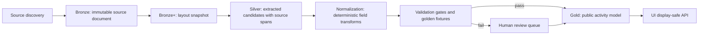

# Source-To-UI Pipeline Overhaul

## Decision

We should refactor the activity data pipeline. The frontend does not need a full rewrite, but the source-to-public-data path does. The current system has useful pieces of a medallion architecture, yet it still allows raw or weakly validated parser output to become public UI. That is the trust failure.

The target is not "never breaks." PDF schedules can change shape without warning. The achievable standard is stricter: the system must fail closed, preserve source evidence, and never publish claims that cannot be traced to source or reviewed enrichment.

## Evidence From The Current Failure

- `WELLNESS SCAVENGER HUNT` was transformed into a fake title and slug, which means title normalization was allowed to invent display data.
- The PDF contains interleaved columns, so plain extracted text can mix one activity's title, another activity's location, and a third activity's description.
- Description and end-time loss reached public UI, which means validation did not enforce required source fidelity before publish.
- "Walkable -- no transportation needed" was a UI inference without source evidence.
- Legacy broken slugs remained addressable as if they were valid activity identities.

## External Design Inputs

- Databricks' medallion guidance defines bronze as raw source fidelity, silver as validation/cleanup, and gold as business-facing data. It specifically calls out validation, schema enforcement, missing values, deduplication, and preserving raw fidelity in bronze.
- PyMuPDF documents that plain PDF text extraction may not be in natural reading order and recommends using blocks or words with position information when reading order matters.
- pdfplumber exposes page objects, characters, words, rectangles, lines, coordinates, and visual debugging, which is exactly the kind of evidence needed for source spans.
- Pydantic's current validation docs support model-driven schemas, ordered validation errors, and JSON Schema generation, which is the right direction for the next step of formalizing Bronze/Silver/Gold contracts beyond ad hoc dictionaries.
- Great Expectations' Data Docs model is a useful pattern for turning data quality checks and validation results into a human-readable, always-current source-of-truth report for operators.
- Supabase's API security guidance requires RLS on exposed tables/views and careful control of functions/views. Gold publication tables/views need explicit public access rules and private review tables need restricted access.

## Target Architecture

## Layer Contracts

### Bronze

Bronze stores the untouched source and source metadata.

Required fields:
- `source_document_id`
- `canonical_url`
- `fetched_url`
- `content_sha256`
- `content_length`
- `etag`
- `http_status`
- `storage_path`
- `calendar_group_key`
- `fetched_at`

Rules:
- Never mutate or overwrite source bytes.
- Use SHA-256 as immutable identity.
- For official web line snapshots, use a canonical visible-content hash over source kind, URL, line numbers, and line text. Capture metadata such as `captured_at` and raw HTML diagnostics must not cause fixture drift by itself.
- Keep every historical document for audit and reprocessing.
- A changed URL or changed hash creates a new source document and must trigger extraction plus review gates.

### Bronze+ Layout Snapshot

Layout snapshots turn the PDF into deterministic evidence, not activity data.

Required fields:
- document hash
- page count
- page dimensions
- word text and bounding boxes
- line text and bounding boxes
- block, line, and word order references

Rules:
- Every downstream extracted field must be traceable to one or more layout spans.
- Plain text is diagnostic only; extraction logic should prefer geometry-aware lines/regions.

### Silver Candidates

Silver contains extracted candidates, preserving both raw source text and parser interpretation.

Required fields:
- `candidate_id`
- `source_document_id`
- `content_sha256`
- `calendar_group_key`
- `parser_version`
- `profile_key`
- `raw_fields`
- `normalized_fields`
- `source_spans`
- `confidence`
- `warnings`
- `needs_review_reason`

Rules:
- Silver may contain invalid candidates.
- Silver must not invent fields. Missing source text is represented as missing, not guessed.
- Low-confidence or incomplete candidates are quarantined, not dropped.
- Footer/key legends are document-level evidence. They may support claims such as fee markers, but they must not be promoted into activity descriptions, locations, or schedules unless a fixture explicitly proves the text belongs to that activity.
- Extracted candidates carry footer/key legends in `normalized_fields.document_key_legends`; promoted Gold rows expose them as `source.documentKeyLegends` so UI/API consumers retain the same document-level evidence.

### Normalization

Normalization cleans representation without changing meaning.

Allowed:
- Unicode normalization.
- Whitespace cleanup.
- Dash/quote normalization for display.
- Deterministic time parsing from explicit source text.
- Known-title repair only when the repair table maps the exact source key to a reviewed canonical value.

Forbidden:
- Word segmentation that invents new titles from OCR fragments.
- Inferring fee, walkability, indoor/outdoor, age fit, or transportation from category alone.
- Replacing missing source descriptions with marketing summaries in public source-derived fields.

### Gold Public Model

Gold is the only layer the UI should use.

Required fields:
- canonical activity id
- canonical slug
- display title
- resort/calendar group
- schedule object with start/end/source text/uncertainty
- location object with source text/uncertainty
- description object with source text/review state
- source document pointer
- field-level provenance
- public trust state

Rules:
- Gold only publishes fields that pass source-span validation.
- Gold `activity_catalog_id` is a stable UUID derived from calendar group plus canonical slug. It must not include source hashes; source-specific lineage stays in `candidate_id`, `source_sha256`, and field provenance.
- Any source-derived field without provenance is either hidden, marked unknown, or blocked from publish depending on severity.
- Public API returns display-safe fields only; raw ingest fields stay private.

### Human Review

Review is required when:
- A PDF hash changes and no golden fixture exists for that profile/hash.
- A required public field is missing or unspanned.
- The parser detects cross-activity bleed.
- Title repair is not in the reviewed repair table.
- The parser confidence drops below the publish threshold.
- A source field changed from the prior edition in a way that affects public UI.

### Claims Engine

Claims are separate from source extraction.

Examples:
- `transportation`: unknown, same_resort, same_area, requires_route_check
- `environment`: unknown, indoor, outdoor, mixed
- `fee`: free, fee, unknown
- `walkability`: unknown, source_supported, reviewed_supported

Rules:
- Category is never sufficient evidence for a claim.
- Unknown claims should display conservative UI copy or stay hidden.
- Claims must cite source text, structured Disney data, or reviewed enrichment.

## Golden Fixtures

Each supported layout profile needs fixtures with expected extracted records and source spans.

Fixture minimum:
- canonical title
- slug
- schedule text
- start time
- end time
- location
- description
- fee flag
- page and line/span references for every source-derived field

CI must fail when:
- A fixture record disappears.
- A title, slug, schedule, description, or source span changes unexpectedly.
- Any public record has unreviewed warnings.
- Any public field contains PDF boilerplate, OCR-spaced headings, or text from another activity.

## Current Gap Assessment

| Area | Current State | Required State |
| --- | --- | --- |
| Bronze bytes | Partial: PDFs cached and source_documents exist | Keep immutable source history and link every extraction to hash |
| Layout evidence | Missing until this overhaul | Deterministic word/line snapshots with coordinates |
| Silver candidates | `activities_ingest.json` mixes raw and cleaned fields | Candidate model with raw, normalized, spans, confidence, warnings |
| Validation | Present but incomplete | Gate by schema, provenance, completeness, cross-field consistency, fixtures |
| Publication | Can publish weak parser output | Gold-only promotion with fail-closed review queue |
| UI | Has display cleanup and trust badges | UI consumes display-safe fields and never raw ingest |
| Unsupported claims | Present in nearby copy | Claims require evidence or display unknown |
| Slugs | Broken legacy slugs can resolve | Canonical identity plus redirects only |

## Implementation Phases

1. Lock down evidence: layout snapshots, source spans, schema contracts.
2. Build Silver v2 candidates alongside current output without switching production.
3. Add fixture-based validators for current All-Star PDFs and other high-risk profiles.
4. Add Gold v2 public model and API adapter.
5. Switch UI reads to Gold v2.
6. Add review queue and operational dashboards.
7. Retire direct raw-ingest publication.

## Current Implementation Checkpoint

Completed in the v2 path:
- Deterministic layout snapshots for PDF word/line evidence.
- OCR layout fallback for image-only PDFs, with confidence-filtered word boxes converted back into the same page/line evidence model.
- Golden fixtures for All-Star Movies, All-Star Music, and All-Star Sports Wellness Scavenger Hunt records.
- Silver v2 extraction that preserves raw fields, normalized fields, source spans, PDF hash, and parser version.
- Full source-spanned Silver v2 extraction for the All-Star Movies A-frame calendar, including 11 real activities and 7 movie-night rows, without the legacy synthetic `resort-scavenger-hunt`, `arcade`, or `campfire` contamination records.
- Contract validation that blocks missing provenance and unsupported claims.
- Local Gold promotion preview that publishes only validation-passing records and quarantines invalid candidates.
- Pipeline orchestration that runs strict legacy validation, v2 fixture validation, and Gold v2 promotion before any publish.
- Public activity contract fields for source evidence, field provenance, claims, and trust state; verified badges now require the source contract.
- Gold v2 UI mapper and controlled read modes: `ACTIVITY_DATA_PIPELINE=gold-v2-preview` reads the local Gold preview artifact, and `ACTIVITY_DATA_PIPELINE=gold-v2` reads `v_public_activity_gold`.
- Gold preview promotion now uses stable UUID activity catalog ids, keeping public identity unchanged when Disney source hashes change.
- Gold v2 Supabase publisher now upserts Bronze `source_documents`, stable `activity_catalog` rows, and `public_activity_gold` rows, then fails on `check_activity_pipeline_v2_health()` issues.
- Coverage audit for cutover readiness: current partial mode reports missing groups, per-group row undercoverage, and fixture-backed legacy overcounts/undercounts. Once a group has a full-calendar fixture and matching Gold rows, that fixture becomes the coverage baseline instead of the contaminated legacy parser count.
- Supabase migration draft for layout snapshots, extraction candidates, field provenance, review queue, claims, Gold public records, and legacy slug redirects.
- Durable review-decision CLI at `scripts/ingest/review_queue.py`. Review approvals can clear parser warnings, but cannot override missing required source spans or other validation errors.
- Production `run_pipeline.py` now runs `audit_coverage.py --require-production-ready` before publish. Local-only runs the partial audit; production publication is blocked until Gold v2 coverage and UI mode are cut over.
- Full-calendar source-spanned fixtures for All-Star Movies, All-Star Music, and All-Star Sports. The Music/Sports pass fixed QR helper text, split schedule lines, section-heading bleed, footer bleed, and `Touchdown! Campfire` extraction.
- Full-calendar source-spanned fixture for Beach/Yacht Club. It covers title-as-location venue cases, split schedule continuations, 24-hour schedule normalization, long same-column descriptions, and footer/key legend exclusion from descriptions.
- Full-calendar source-spanned fixtures for Animal Kingdom Jambo House and Kidani Village. They cover combined `Daily at/throughout` schedule-location lines, stacked title lines, 24-hour fitness schedules, movie-night rows, and legacy parser undercounts.
- Full-calendar source-spanned fixture for Grand Floridian. It covers service/venue titles used as locations when Disney provides no separate location line, split service titles, 24-hour health club schedules, movie-night rows, and another legacy parser undercount.
- Full-calendar source-spanned fixture for Art of Animation. It covers stacked titles, inline location/schedule lines, movie location headings, split multi-slot schedules, fee markers, and an expected quarantine for `Nighttime Pool Party`, whose title is source-visible but schedule/location fields are not source-backed enough to publish.
- Full-calendar source-spanned fixture for BoardWalk. It covers same-baseline two-column line splitting, QR helper exclusion from activity titles, orphan block bleed prevention, and expected quarantines for `Poolside Activities` and `Crescent Lake Wellness Challenge`, where Disney's PDF omits required public schedule/location fields.
- Full-calendar source-spanned fixture for Old Key West. It publishes 14 source-backed records, covers split `Near` movie location headings and fee-marker activities, repairs reviewed OCR-damaged descriptions for `Disney Fit Yoga`, `Conch Crazy Bingo`, and `Conch Flats Mosaics`, and promotes `Bike Rentals` through reviewed manual visual evidence for the OCR-missed `Daily from 10:00am-6:30pm` schedule.
- Full-calendar fixture validation now audits every extracted source candidate. A candidate can no longer disappear just because it is not listed in `expected_records`; it must be either an expected public record or an explicit `expected_quarantine_records` entry with source spans and matching warnings.
- Fee claims now use the PDF key/legend correctly: `($)` activities publish `fee` with title-marker and footer legend source evidence, and the same legend is preserved on the Gold source object; unmarked activities publish price as `unknown`, not inferred `free`.
- Image-only OCR layout hardening now splits near-threshold same-baseline columns that previously merged unrelated activity text. Riviera and Wilderness Lodge parser tests cover QR helper text being blocked as a title, `Starlight Soiree` not bleeding into `Painting on the Riviera`, split movie-lawn schedules, venue-title locations such as `The Eventi Room`, and low-quality OCR warnings for corrupted fields.
- Production readiness now treats expected quarantine records as release blockers. Partial audits warn on quarantine count; `audit_coverage.py --require-production-ready` fails until those source-visible records are either repaired, reviewed into Gold with valid provenance, or removed as proven non-public source noise.
- Full-calendar source-spanned fixture for Riviera. It publishes 10 source-backed records, promotes `Painting On The Riviera` through reviewed manual visual evidence for the OCR-missed `12 and up` and `407-WDW-PLAY` description text, and promotes `Find A Friend` through reviewed manual visual title evidence when OCR misses the heading.
- Full-calendar source-spanned fixture for Pop Century. It publishes 10 source-backed records, repairs the reviewed `Poolside Activities` OCR schedule from `1:;00pm` to `1:00pm`, promotes `Paint Your Own Bowling Pin` through reviewed manual visual title/location evidence, merges the stacked `Marble Painting On Vinyl Records ($)` title, and suppresses movie-table OCR fragments such as `ENCANO` as fake standalone activities.
- Full-calendar source-spanned fixture for Polynesian. It publishes 10 source-backed records after promoting `Campfire` and `Aloha After Dark` through reviewed manual visual evidence for OCR-missed source fields: Campfire's `Seven Seas Lagoon Beach` location and Aloha After Dark's `8:00pm` schedule. `Video Game Dance Party` is also promoted through reviewed manual visual title evidence while preserving the supporting location/schedule/description spans.
- Full-calendar source-spanned fixture for Port Orleans Riverside. It publishes 12 source-backed records, repairs reviewed `Ol’ Man Island` OCR location text from source-spanned lines, promotes `Medicine Show Arcade` and `Arts & Crafts` through reviewed manual visual evidence for OCR-missed schedule/table rows, and promotes `Nighttime Trivia Challenge` plus `Glow With The Flow` through reviewed manual visual evidence for the bottom-right activity blocks.
- Full-calendar source-spanned fixture for Port Orleans French Quarter. It publishes 10 source-backed records, repairs reviewed OCR-truncated location fields through `data/quality/activity_field_repairs.json`, joins split location continuations such as `Throughout Disney’s Port Orleans Resort - French Quarter`, promotes `Arts & Crafts` through reviewed manual visual evidence for the craft-table rows, and quarantines `Movie Under the Stars` because OCR still cannot safely preserve the movie table details.
- Full-calendar source-spanned fixture for Caribbean Beach. It publishes 9 source-backed records, recovers low-contrast activity headings through a scored enhanced OCR pass, blocks resort headers and movie-table day labels as fake activity titles, preserves the footer fee legend as document-level evidence, repairs the source-reviewed Seashell fee marker when full-page OCR drops `($)`, and keeps movie-night rows out of Gold until the movie table can be source-spanned reliably.
- Full-calendar source-spanned fixture for Coronado Springs. It publishes 10 source-backed records, repairs the corrupted `FITNE Ss S CENTERS` OCR heading into `Fitness Centers`, promotes `Spanish Mosaic Art` and `Colors Of Coronado Painting Experience` through reviewed manual visual evidence for OCR-fragmented description/location/schedule fields, suppresses craft-table option cells such as `Mickey Tie-Dye` as fake standalone activities, and quarantines `Arts & Crafts`, `Sangria University`, and `Resort Scavenger Hunt` because OCR or Disney's source omits required public schedule/location/description fidelity.
- Full-calendar source-spanned fixture for Saratoga Springs. It publishes 14 source-backed records, recovers the lower-page `Glow With The Flow`, `Bicycle Rentals`, `Nighttime Bingo`, `Winner’s Circle Mosaics`, and `Win, Paint, Show!` blocks, conditionally escalates OCR when a title line is visibly corrupted as a one- or two-letter `RENTALS` fragment, blocks resort/header text such as `ACTIVITES`, and treats footer fee legends as document-level evidence rather than activity copy.
- Full-calendar source-spanned fixture for Contemporary. It publishes 11 source-backed records, blocks QR helper/header text as fake activities, conditionally escalates OCR when Cabana Rentals' time range is visibly corrupted, repairs the reviewed `407-WDW-PLAY` phone OCR, joins multi-line locations such as `... Contemporary Tower / and Bay Lake Tower`, parses `Contemporary Feature Pool: ...` schedule/location lines without contaminating descriptions, preserves split movie-night rows, and quarantines `Sports Courts` because Disney's source provides no required public schedule/location fields.
- Full-calendar source-spanned fixture for Wilderness Lodge. It publishes 13 source-backed records, conditionally escalates sparse OCR when the chosen OCR output contains visible damage such as orphan `Daily at` schedules or campfire text bleed, recovers `Campfire`, `Daily at 2:00pm` poolside activities, parenthetical `Near Copper Creek Springs Pool` location continuations, the multi-line `Family Activities and Crafts` schedule, Storytime Yoga waiver copy, Tasteful Artistry reservation copy, and split movie-night rows while preserving the footer fee/change legend as document-level evidence.
- Official web source fixtures are now first-class alongside PDF fixtures. Fort Wilderness has no verified A-frame recreation PDF, so its official Disney recreation page is captured as a deterministic line snapshot and validated with the same span-based fixture machinery.
- Official web detail snapshots can now enrich source-visible resort overview rows. Fort Wilderness promotes Canoe Rentals, Kayak Rentals, Fort Wilderness Archery Experience, and Pony Rides from their official Disney detail pages because those snapshots contain title, description, location, schedule/hour, price evidence, stable visible-content source hashes, and line spans. The remaining 16 Fort overview activities stay quarantined because their captured source evidence still lacks required public schedule/location provenance.
- Reviewed field repairs now have a dedicated exact-match table for non-title OCR losses. A repair is scoped by calendar group, slug, field, and raw OCR value; if Disney changes the PDF text, the repair stops matching and fixture validation fails instead of silently applying stale data.
- Fixtures can now declare `reviewed_manual_records` with full public fields, source locators, and manual review metadata. These records become ordinary source-backed Gold rows only after passing the same fixture drift, source-span, and promotion gates as parser-extracted records.
- Fixtures can still declare `expected_unextractable_records` for source-visible records that are not yet safely extracted or manually reviewed. Those records do not become Gold, do not count as safely published coverage, and block production cutover until resolved.
- Schedule quality gates now flag malformed OCR time strings such as `1:;00pm` and `Daily f 10: -7:` as `schedule:text_quality_low`, preserving source text but preventing silent publication.
- Movie schedule extraction now handles split location/time lines, such as Port Orleans Riverside's `OAK MANOR LAWN` plus `NEAR BUILDING 90 | 8:30PM`, and suppresses the consumed location line as a fake standalone activity.
- Official recreation offerings are now included in the cutover audit as a separate non-calendar coverage path. Exact source-backed official offering matches are still visible in fixture quarantine totals, but they no longer count as blocking scheduled-Gold cutover records.
- Reviewed official-offering aliases now cover Fort Wilderness source rows where Disney uses different names across official pages, such as `Jogging Trails` -> `Running Trails`, `Wagon Rides` -> `Horse Drawn Excursion - Wagon Ride`, and the two named Fort Wilderness arcades -> `Arcades`.
- Fort Wilderness resort recreation overview pages now contribute only allowlisted overview-only official offerings, such as Basketball Courts, Electrical Water Pageant, and Wilderness Back Trail Adventure, with hours explicitly marked as not specified by Disney.
- Official recreation merging now prefers downstream official detail/resort-page rows over less complete parent-index rows for the same program and resort. The parent index remains a fallback for detail pages that say only `Multiple Locations`, while the coverage audit now checks 180 parent-index resort pairs and 190 downstream detail/resort-page resort pairs so detail-only resort joins cannot silently drop.
- Official offerings that Disney marks as currently unavailable are parsed as calendar-dependent unavailable rows and mapped to paused UI status instead of being shown as available daily.
- `npm run trust:report` now builds an operator-facing source-to-UI trust report with Gold, fixture, official recreation, total quarantine, official-offering-covered quarantine, and blocking quarantine counts.

Still required before production cutover:
- Apply and verify the Supabase migration against a running database.
- Expand fixture coverage beyond the current twenty full-calendar PDF groups and two official-web Fort Wilderness groups to every active source profile and activity record. Current audit: 240 fixture records / 237 Gold rows, 224 official recreation resort offerings, 34 fixture quarantine records, all 34 official-offering-covered including 13 reviewed alias-covered rows, 0 blocking fixture quarantine records, and 3 explicit non-publishable source-visible records. No cached PDF-backed group lacks fixture-backed Gold coverage. Coverage-required count is now fixture-backed at 237, not the contaminated legacy count, because full-calendar fixtures, reviewed manual records, explicit quarantines, explicit non-publishable decisions, and official-offering coverage are authoritative and legacy overcounts/undercounts are reported separately from real gaps.
- Keep the remaining 34 Fort Wilderness official-web quarantine rows visible until they are either directly resolved or removed by a stronger official-offering reconciliation. They are not cutover blockers because all 34 are already covered by official recreation offerings. The 3 explicit non-publishable rows are documented source-visible records whose PDFs do not support enough public fields to publish.
- Continue Fort Wilderness detail-page enrichment or locate an authoritative dated recreation PDF. The remaining Fort activities must stay quarantined until schedule/location spans are sourced, or a reviewed non-public decision is recorded per activity.
- Switch public activity reads to Gold v2 or a security-invoker view over it.
- Make Gold v2 the default public read path after fixture coverage reaches the active catalog.
- Remove any direct publication path from legacy parser output to public UI.
- Expand operator-facing review/reporting beyond the current trust report into changed PDF hash monitoring, fixture gap review, and validation failure triage.
- Run API trust smoke tests against a started app or deployed preview after the Gold v2 cutover.

## Non-Negotiable Invariants

- No source-derived public field without provenance.
- No generated claim without evidence.
- No changed PDF auto-publishes without validation.
- No low-confidence parser output in public UI.
- No legacy broken slug becomes canonical.
- No public page should be better at sounding confident than the data actually is.
